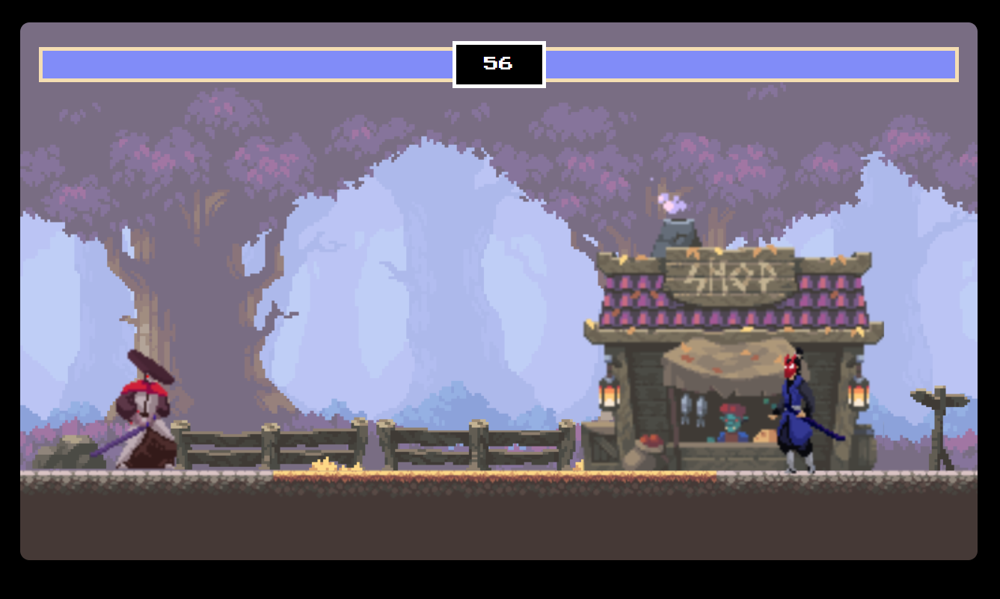

# Ninja-Fighting-Game

## Introduction
Welcome to the Ninja Fighting Game repository! This project aims to deliver an exciting and immersive gaming experience by creating a dynamic, browser-based fighting game using JavaScript.

This repository serves as a playground for game developers, JavaScript enthusiasts, and aspiring programmers to explore the intricacies of game development. Through this project, we dive into the fundamentals of building a fighting game, incorporating essential concepts such as character movement, combat mechanics, and game dynamics.

## Features:
- Character Control: Implementing smooth and responsive character movements.
- Attack and Defense Mechanics: Creating engaging combat interactions between characters.
- Game Loop Management: Ensuring a seamless gaming experience through efficient game loop handling.
- Collision Detection: Handling collisions between characters and their environments.

## Technologies and Tools
The project primarily utilizes JavaScript for game logic and HTML5 canvas for rendering graphics. While focusing on the core principles of game development, additional libraries or frameworks might be explored to aid in certain functionalities.

## How to play 
To get started, clone the repository and explore the codebase. Check out the documentation and code comments for insights into the game's structure and functionalities. Contributions, bug fixes, and enhancements are welcomed through pull requests.

This project aims to be a learning resource and a fun, interactive demonstration of JavaScript game development. Join us on this journey as we create an entertaining fighting game, learning and exploring along the way!

## Contributing
Contributions to this project are welcome! If you find any bugs or have suggestions for improvements, please open an issue or create a pull request.

There are some files added with this repo if you want fork it and use those resources to modify the game even more

### Contributors:
 

<a href="https://shback007.github.io/Ninja-Fighting-Game/" target="_blank">Game Link</a>
